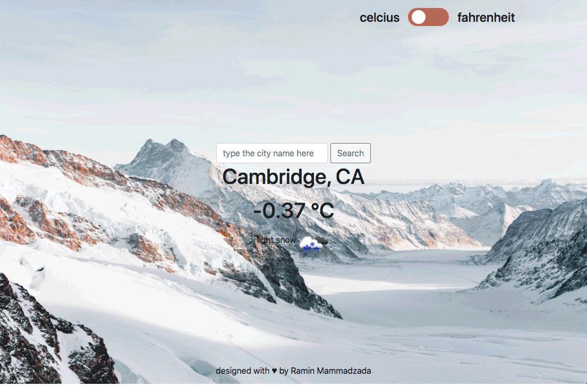

Microverse JS Project #4

## JS - Weather App v1.1

This is a javascript Weather app project. It fetchs live weather updates and results from Weather API. The project also also makes use of Unsplash API to change the background image based on the weather condition. The page is dynamically rendered by using JavaScript DOM manipulation. JavaScript is used to generate the entire contents of the website. CSS is used to stylize.

The [requirements in Odin page](https://www.theodinproject.com/courses/javascript/lessons/weather-app) is followed.

The page is made with modular valinna JS (JS6) and the following milestones are finished:

- [x] Milestone 1 - Setup HTML webpack to load style files, and pictures.
- [x] Milestone 2 - Create an MVC structure to create view files, model to fetch data and controller to populate data to view via model.
- [x] Milestone 3 - Setup [Unsplash API](https://unsplash.com/developers) and [OpenWeather API](https://openweathermap.org/api) to fetch data.
- [x] Milestone 4 - Add extra spinning loader.

## Built With

- Javascript/ES6 Modules
- Fetch Api
- npm v14.13.1
- Webpack 5.11.0
  - [HtmlWebpackPlugin](https://webpack.js.org/plugins/html-webpack-plugin/)
  - [style-loader](https://webpack.js.org/loaders/style-loader/#root)
  - [css-loader](https://webpack.js.org/loaders/css-loader/#root)
  - [file-loader](https://webpack.js.org/loaders/file-loader/#root)
  - [DevServer](https://webpack.js.org/configuration/dev-server/)
- HTML5/CSS
- Github Actions
- Bootstrap v4.5
- ESLint
- Stylelint

## Live Demo

[Live Demo Link](https://raminmammadzada.github.io/js-weather-app/)

## Getting Started

To get a local copy up and running follow these simple example steps.

- Clone the repository by runing `git clone git@github.com:RaminMammadzada/js-weather-app.git` on your terminal
- Go into project folder `cd js-weather-app`
- Run `npm install`
- Run `npm run build`, if you want to create built files.
  - Alternatively, run `npm run dev`, if you will work on it to improve.
- Go into `dist` folder by typing `cd dist` and open `index.html` file using your favorite browser.

## Authors

👤 **Ramin Mammadzada**

- Github: [@RaminMammadzada](https://github.com/RaminMammadzada)
- Twitter: [@RaminMammadzada](https://twitter.com/RaminMammadzada)
- Linkedin: [@RaminMammadzada](https://www.linkedin.com/in/raminmammadzada)

## 🤝 Contributing

Contributions, issues and feature requests are welcome!

Feel free to check the [issues page](issues/).

## Show your support

Give a ⭐️ if you like this project!

## Acknowledgments

- Microverse
- Odin project

## 📝 License

This project is [MIT](lic.url) licensed.
